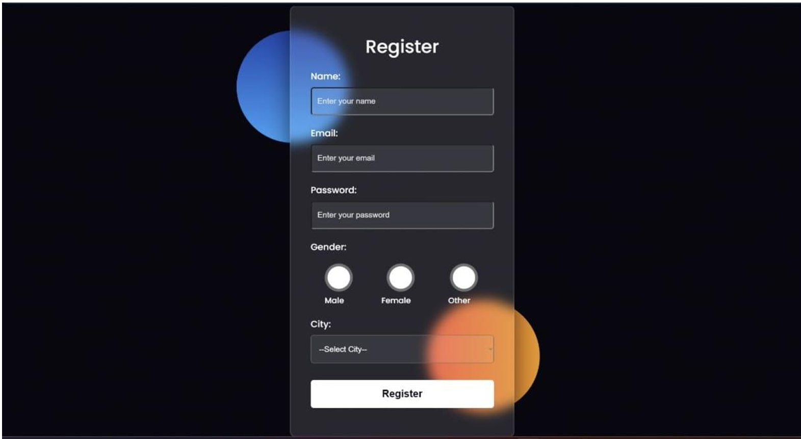
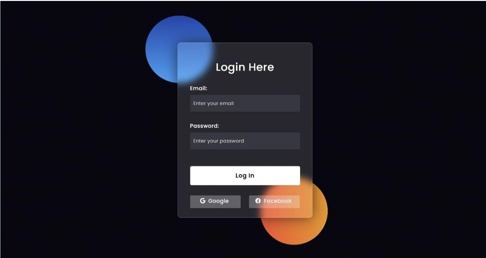

# User Access Control System

A web-based Java project developed as part of the **Web Based Java Programming** (Course Code: 4350708) course in the Diploma Engineering program at Gujarat Technological University (GTU).

## 📋 Project Overview

This project demonstrates a secure and efficient user management system using JSP, Servlets, and MySQL. It covers user registration, login with session management, and a personalized profile page.

## 📸 Screenshots

### Registration Page


### Login Page


### Profile/Welcome Page


## 🛠️ Technologies Used

- **JSP** (Java Server Pages) – Dynamic web pages
- **Java Servlets** – HTTP request/response processing
- **JDBC** – MySQL database connectivity
- **MySQL** – Backend database
- **Apache Tomcat** – Web server

## 📁 Project Structure

```
UserAccessControlSystem/
├── src/
│   └── main/
│       ├── java/
│       │   └── in/sp/backend/
│       │       ├── Register.java      # Servlet for user registration
│       │       └── Login.java         # Servlet for user login
│       └── webapp/
│           ├── Register.jsp           # Registration form UI
│           ├── Login.jsp              # Login form UI
│           ├── Profile.jsp            # Welcome/Profile page
│           └── WEB-INF/
│               └── web.xml
├── screenshots/
│   ├── register.png
│   ├── login.png
│   └── profile.png
└── README.md
```

## ⚙️ Features

- **User Registration** – Collects name, email, password, gender, and city; stores in MySQL
- **User Login** – Validates credentials against the database
- **Session Management** – Stores logged-in user's name in session
- **Profile Page** – Displays a personalized welcome message after login

## 🗄️ Database Setup

Run the following SQL to set up the database:

```sql
CREATE DATABASE wbjp_microproject;

USE wbjp_microproject;

CREATE TABLE register (
    id INT AUTO_INCREMENT PRIMARY KEY,
    name VARCHAR(100) NOT NULL,
    email VARCHAR(100) NOT NULL UNIQUE,
    password VARCHAR(100) NOT NULL,
    gender VARCHAR(10) NOT NULL,
    city VARCHAR(50) NOT NULL
);
```

> **Note:** The project uses MySQL on port `4306`. Update the connection string in `Register.java` and `Login.java` if your MySQL runs on the default port `3306`.

## 🚀 How to Run

1. Clone this repository
2. Import into Eclipse / IntelliJ as a Dynamic Web Project
3. Set up the MySQL database using the SQL above
4. Deploy on Apache Tomcat (v10+)
5. Open `http://localhost:8080/UserAccessControlSystem/Register.jsp`


## 📅 Submitted

October 22, 2024 — Semester 5, Dipoma in Computer Engineering 
